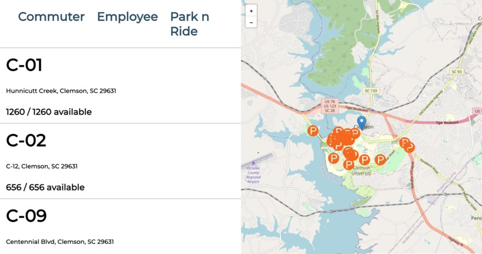

# TigerPark

## Description

A hackathon project built to be a mockup parking reservation app for Clemson University students, made with TypeScript, JavaScript, Node.js, and React. 

## Project Screen Shot(s)

## Installation and Setup Instructions

Clone down this repository. You will need `node` and `npm` installed globally on your machine.  

Installation:

`npm install`  

To Run Test Suite:  

`npm test`  

To Start Server:

`npm start`  

To Visit App:

`http://localhost:3000`  

## Reflection

This project was made at the CU Hackit 2023 hackathon. We had 24 hours to build with no specifications on what to build, other than explore what interests you.

We set out to build an app that solved a problem that was widespread on campus. The parking for commuting students is a pain for many people. We decided to try and build a mock up of a possible solution in which students could reserve a specific spot ahead of time, rather than driving around parking lots aimlessly until they find a spot.

One of the biggest problems we ran into was communication between the front and back end teams. While we defined endpoints early on that were going to be used to transfer data between the database and the front end, some miscommunication between teams led to some big disconnects that were realized only when we went to merge the front and back end. This allowed me to realize the necessity of sticking to the plan in the beginning, and to ensure throughout that everyone is on the same page.

We chose this tech stack because we wanted to use a web app to make it most accessible. JavaScript and Typescript were helpful in order to fit in well with web deveoplemnt and using Node.js to host. We hosted our servers on AWS EC2 servers because they were made available to us through the hackathon for free, and the use of Reacte was preference for ease of use.

